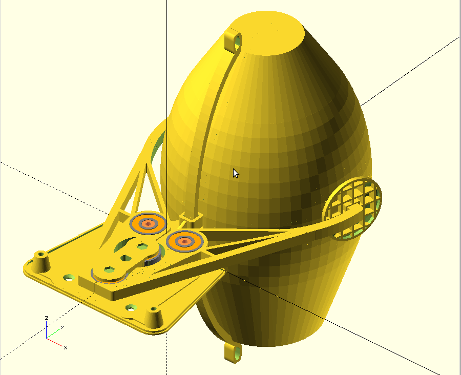

## COSV - Cam Open Source Ventilator.
Cam based ventilator designed to fit directly on an BVM, on the patient.

The [COSV - Cam Open Source Ventilator](https://hackaday.io/project/170507) project is open source hardware. 
This github repository hosts the [OpenSCAD](http://www.openscad.org) source and the rendered STL images for quick access.

Hardware designs (schematics and CAD) files are licensed under the [GNU GENERAL PUBLIC LICENSE Version 3](https://www.gnu.org/licenses/gpl-3.0.md) and follow the terms of the [OSHW (Open-source hardware) Statement of Principles 1.0.](http://freedomdefined.org/OSHW)
